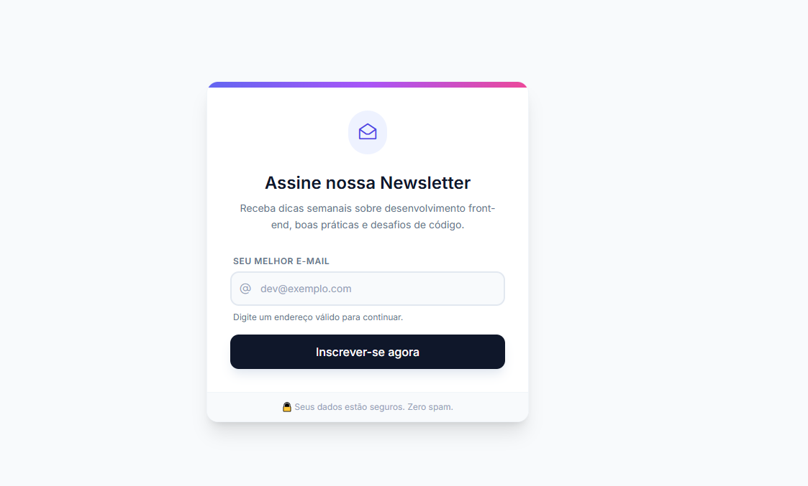

  
  
   

  <h1>✉️ Newsletter Validator - UI Component</h1>

  

    Uma interface de captura de leads focada em <strong>feedback visual imediato</strong> e micro-interações fluídas.
  

---

## 🚀 Missão do Projeto

O objetivo deste desafio foi criar um componente de inscrição de newsletter que vai além do básico, implementando **validação em tempo real** e estados de interface ricos para melhorar a experiência do usuário (UX).

A aplicação transforma um input simples em uma conversa visual com o usuário, guiando-o através de cores, ícones e mensagens contextuais.

## 🎨 Destaques de UI & UX

O projeto foi construído sobre três pilares de design:

### 1. Affordance e Feedback Visual
* **Validação "Ao Vivo":** O usuário não precisa clicar em enviar para saber se errou. O feedback ocorre no evento `input`.
* **Código de Cores Semântico:** 
    * 🔘 **Cinza:** Estado neutro/espera.
    * 🟢 **Verde:** Sucesso/Válido.
    * 🔴 **Vermelho:** Erro/Inválido.
* **Iconografia Dinâmica:** Os ícones dentro do input mudam (`@` -> `Check` -> `Alert`) para reforçar o estado atual.

### 2. Micro-interações e Animações
* **Loading State:** Ao submeter, o botão se transforma para indicar processamento (Spinner), reduzindo a incerteza do usuário.
* **Transições Suaves:** Todas as mudanças de cor e estado possuem `transition-all duration-300` para evitar cortes bruscos na interface.
* **Feedback de Sucesso:** O botão muda de cor e texto após o envio, confirmando a ação sem precisar de *pop-ups* intrusivos.

### 3. Estrutura Limpa
* Uso de **Glassmorphism** leve e sombras (`shadow-xl`) para dar profundidade ao card.
* Tipografia hierárquica usando a fonte **Inter** para máxima legibilidade.

## 🛠️ Tecnologias Utilizadas

* **HTML5 Semântico**: Estrutura acessível e organizada.
* **Tailwind CSS (via CDN)**: Para estilização rápida, responsiva e utilitária.
* **JavaScript (Vanilla ES6+)**: 
    * Manipulação do DOM.
    * Validação via **Regex** (`/^[^\s@]+@[^\s@]+\.[^\s@]+$/`).
    * Simulação de chamadas assíncronas (`setTimeout`).
* **Phosphor Icons**: Biblioteca de ícones vetoriais.
* **Google Fonts**: Fonte Inter.

## 📂 Estrutura de Arquivos

O projeto segue o princípio de separação de responsabilidades:
/ 

  
    ├── img/
    │    ├── image.png
    ├── src/
    │    ├── script.js
    ├── index.html  
    └── README.md

## 🧩 Funcionalidades Lógicas

1.  **Input Listener:** Monitora cada tecla digitada para validar o e-mail instantaneamente.
2.  **Mock API:** Ao clicar em "Inscrever-se", simulamos um envio ao servidor com um delay de 1.5s para demonstrar o estado de carregamento.
3.  **Prevenção de Erros:** O formulário impede o envio se o e-mail for inválido e foca automaticamente no campo de erro.
4.  **Auto Reset:** Após o sucesso, o formulário limpa os campos e retorna ao estado original automaticamente após 3 segundos.

## 🚀 Como Executar

1. Clone este repositório.
2. Abra o arquivo `index.html` em qualquer navegador moderno.
3. Não é necessário instalação de dependências (Node/NPM), pois utilizamos bibliotecas via CDN para máxima portabilidade.

---

  Feito com 💜 para estudos de Front-end

